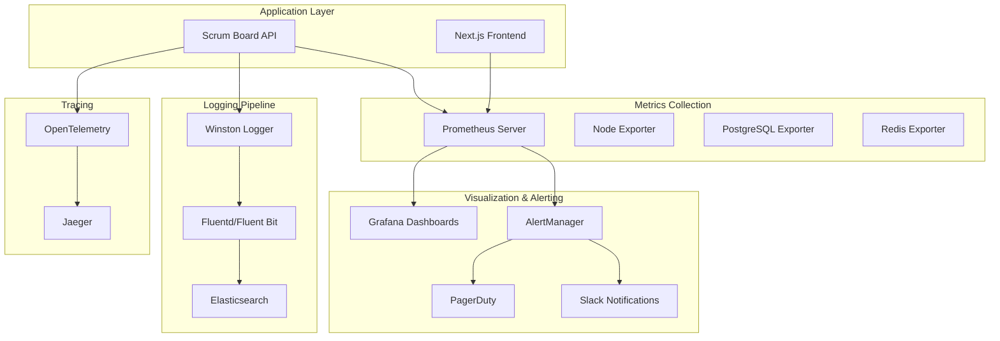

# Authentication System Monitoring & Observability Configuration

## Overview

This document provides comprehensive configuration for monitoring and observability of the Scrum Board authentication system. It includes metrics collection, logging, alerting, and dashboards necessary for production operations.

---

## 1. Monitoring Stack Architecture



## 2. Metrics Collection Configuration

### 2.1 Prometheus Configuration

```yaml
# prometheus.yml
global:
  scrape_interval: 15s
  evaluation_interval: 15s

rule_files:
  - "auth_rules.yml"
  - "performance_rules.yml"

scrape_configs:
  - job_name: 'scrumboard-api'
    static_configs:
      - targets: ['localhost:3001']
    metrics_path: '/metrics'
    scrape_interval: 10s
    scrape_timeout: 5s

  - job_name: 'postgresql'
    static_configs:
      - targets: ['localhost:9187']

  - job_name: 'redis'
    static_configs:
      - targets: ['localhost:9121']

  - job_name: 'node-exporter'
    static_configs:
      - targets: ['localhost:9100']

alerting:
  alertmanagers:
    - static_configs:
        - targets:
          - alertmanager:9093
```

### 2.2 Application Metrics Implementation

```typescript
// src/auth/services/metrics.service.ts
import { Injectable } from '@nestjs/common';
import { Counter, Histogram, Gauge, register } from 'prom-client';

@Injectable()
export class MetricsService {
  // Authentication Metrics
  private readonly authSuccessCounter = new Counter({
    name: 'auth_login_success_total',
    help: 'Total number of successful login attempts',
    labelNames: ['method', 'user_role'],
  });

  private readonly authFailureCounter = new Counter({
    name: 'auth_login_failure_total',
    help: 'Total number of failed login attempts',
    labelNames: ['reason', 'ip_address'],
  });

  private readonly authDuration = new Histogram({
    name: 'auth_request_duration_seconds',
    help: 'Duration of authentication requests',
    labelNames: ['endpoint', 'method'],
    buckets: [0.01, 0.05, 0.1, 0.2, 0.5, 1, 2, 5],
  });

  private readonly activeSessionsGauge = new Gauge({
    name: 'auth_active_sessions_total',
    help: 'Number of currently active user sessions',
  });

  private readonly accountLockoutsCounter = new Counter({
    name: 'auth_account_lockouts_total',
    help: 'Total number of account lockouts',
    labelNames: ['reason'],
  });

  private readonly tokenRefreshCounter = new Counter({
    name: 'auth_token_refresh_total',
    help: 'Total number of token refresh attempts',
    labelNames: ['success'],
  });

  private readonly passwordResetCounter = new Counter({
    name: 'auth_password_reset_total',
    help: 'Total number of password reset attempts',
    labelNames: ['success'],
  });

  // Security Metrics
  private readonly securityEventsCounter = new Counter({
    name: 'security_events_total',
    help: 'Total number of security events',
    labelNames: ['event_type', 'severity'],
  });

  private readonly rateLimitHitsCounter = new Counter({
    name: 'rate_limit_hits_total',
    help: 'Total number of rate limit hits',
    labelNames: ['endpoint', 'limit_type'],
  });

  private readonly suspiciousActivityCounter = new Counter({
    name: 'suspicious_activity_total',
    help: 'Total number of suspicious activity detections',
    labelNames: ['activity_type', 'action_taken'],
  });

  // Performance Metrics
  private readonly dbQueryDuration = new Histogram({
    name: 'database_query_duration_seconds',
    help: 'Duration of database queries',
    labelNames: ['operation', 'table'],
    buckets: [0.001, 0.005, 0.01, 0.025, 0.05, 0.1, 0.25, 0.5],
  });

  private readonly redisOperationDuration = new Histogram({
    name: 'redis_operation_duration_seconds',
    help: 'Duration of Redis operations',
    labelNames: ['operation'],
    buckets: [0.001, 0.002, 0.005, 0.01, 0.025, 0.05, 0.1],
  });

  constructor() {
    // Register all metrics
    register.registerMetric(this.authSuccessCounter);
    register.registerMetric(this.authFailureCounter);
    register.registerMetric(this.authDuration);
    register.registerMetric(this.activeSessionsGauge);
    register.registerMetric(this.accountLockoutsCounter);
    register.registerMetric(this.tokenRefreshCounter);
    register.registerMetric(this.passwordResetCounter);
    register.registerMetric(this.securityEventsCounter);
    register.registerMetric(this.rateLimitHitsCounter);
    register.registerMetric(this.suspiciousActivityCounter);
    register.registerMetric(this.dbQueryDuration);
    register.registerMetric(this.redisOperationDuration);
  }

  // Authentication Metrics Methods
  recordLoginSuccess(method: string, userRole: string) {
    this.authSuccessCounter.labels(method, userRole).inc();
  }

  recordLoginFailure(reason: string, ipAddress: string) {
    this.authFailureCounter.labels(reason, ipAddress).inc();
  }

  recordAuthDuration(endpoint: string, method: string, duration: number) {
    this.authDuration.labels(endpoint, method).observe(duration);
  }

  updateActiveSessionsCount(count: number) {
    this.activeSessionsGauge.set(count);
  }

  recordAccountLockout(reason: string) {
    this.accountLockoutsCounter.labels(reason).inc();
  }

  recordTokenRefresh(success: boolean) {
    this.tokenRefreshCounter.labels(success.toString()).inc();
  }

  recordPasswordReset(success: boolean) {
    this.passwordResetCounter.labels(success.toString()).inc();
  }

  // Security Metrics Methods
  recordSecurityEvent(eventType: string, severity: string) {
    this.securityEventsCounter.labels(eventType, severity).inc();
  }

  recordRateLimitHit(endpoint: string, limitType: string) {
    this.rateLimitHitsCounter.labels(endpoint, limitType).inc();
  }

  recordSuspiciousActivity(activityType: string, actionTaken: string) {
    this.suspiciousActivityCounter.labels(activityType, actionTaken).inc();
  }

  // Performance Metrics Methods
  recordDbQueryDuration(operation: string, table: string, duration: number) {
    this.dbQueryDuration.labels(operation, table).observe(duration);
  }

  recordRedisOperationDuration(operation: string, duration: number) {
    this.redisOperationDuration.labels(operation).observe(duration);
  }
}
```

### 2.3 Metrics Controller

```typescript
// src/monitoring/metrics.controller.ts
import { Controller, Get, Header } from '@nestjs/common';
import { register } from 'prom-client';

@Controller('metrics')
export class MetricsController {
  @Get()
  @Header('Content-Type', register.contentType)
  async getMetrics(): Promise<string> {
    return register.metrics();
  }
}
```

### 2.4 Performance Interceptor

```typescript
// src/common/interceptors/metrics.interceptor.ts
import { Injectable, NestInterceptor, ExecutionContext, CallHandler } from '@nestjs/common';
import { Observable } from 'rxjs';
import { tap } from 'rxjs/operators';
import { MetricsService } from '../monitoring/metrics.service';

@Injectable()
export class MetricsInterceptor implements NestInterceptor {
  constructor(private readonly metricsService: MetricsService) {}

  intercept(context: ExecutionContext, next: CallHandler): Observable<any> {
    const request = context.switchToHttp().getRequest();
    const startTime = Date.now();
    const endpoint = request.route?.path || request.url;
    const method = request.method;

    return next.handle().pipe(
      tap(() => {
        const duration = (Date.now() - startTime) / 1000;

        if (endpoint.includes('/auth/')) {
          this.metricsService.recordAuthDuration(endpoint, method, duration);
        }
      }),
    );
  }
}
```

## 3. Structured Logging Configuration

### 3.1 Winston Logger Configuration

```typescript
// src/common/logger/logger.service.ts
import { Injectable, LoggerService } from '@nestjs/common';
import * as winston from 'winston';
import { ElasticsearchTransport } from 'winston-elasticsearch';

interface LogContext {
  userId?: string;
  sessionId?: string;
  ipAddress?: string;
  userAgent?: string;
  requestId?: string;
  module?: string;
  operation?: string;
}

@Injectable()
export class CustomLoggerService implements LoggerService {
  private readonly logger: winston.Logger;

  constructor() {
    const transports: winston.transport[] = [];

    // Console transport for development
    if (process.env.NODE_ENV !== 'production') {
      transports.push(
        new winston.transports.Console({
          format: winston.format.combine(
            winston.format.colorize(),
            winston.format.simple(),
          ),
        }),
      );
    }

    // File transport for all environments
    transports.push(
      new winston.transports.File({
        filename: 'logs/error.log',
        level: 'error',
        format: winston.format.json(),
      }),
      new winston.transports.File({
        filename: 'logs/combined.log',
        format: winston.format.json(),
      }),
    );

    // Elasticsearch transport for production
    if (process.env.NODE_ENV === 'production' && process.env.ELASTICSEARCH_URL) {
      transports.push(
        new ElasticsearchTransport({
          clientOpts: { node: process.env.ELASTICSEARCH_URL },
          index: 'scrumboard-logs',
          source: 'scrumboard-api',
        }),
      );
    }

    this.logger = winston.createLogger({
      level: process.env.LOG_LEVEL || 'info',
      format: winston.format.combine(
        winston.format.timestamp(),
        winston.format.errors({ stack: true }),
        winston.format.json(),
      ),
      defaultMeta: { service: 'scrumboard-api' },
      transports,
    });
  }

  log(message: string, context?: LogContext) {
    this.logger.info(message, context);
  }

  error(message: string, trace?: string, context?: LogContext) {
    this.logger.error(message, { trace, ...context });
  }

  warn(message: string, context?: LogContext) {
    this.logger.warn(message, context);
  }

  debug(message: string, context?: LogContext) {
    this.logger.debug(message, context);
  }

  verbose(message: string, context?: LogContext) {
    this.logger.verbose(message, context);
  }

  // Security-specific logging methods
  logSecurityEvent(
    eventType: string,
    severity: 'low' | 'medium' | 'high' | 'critical',
    details: any,
    context?: LogContext,
  ) {
    this.logger.warn(`Security Event: ${eventType}`, {
      ...context,
      eventType,
      severity,
      details,
      timestamp: new Date().toISOString(),
    });
  }

  logAuthEvent(
    operation: string,
    success: boolean,
    details: any,
    context?: LogContext,
  ) {
    const level = success ? 'info' : 'warn';
    this.logger[level](`Auth ${operation}: ${success ? 'SUCCESS' : 'FAILURE'}`, {
      ...context,
      operation,
      success,
      details,
      timestamp: new Date().toISOString(),
    });
  }

  logPerformanceEvent(
    operation: string,
    duration: number,
    metadata: any,
    context?: LogContext,
  ) {
    const level = duration > 1000 ? 'warn' : 'info'; // Warn if over 1 second
    this.logger[level](`Performance: ${operation}`, {
      ...context,
      operation,
      duration,
      metadata,
      timestamp: new Date().toISOString(),
    });
  }
}
```

### 3.2 Authentication Logging Integration

```typescript
// src/auth/services/auth-logging.service.ts
import { Injectable } from '@nestjs/common';
import { CustomLoggerService } from '../../common/logger/logger.service';
import { MetricsService } from '../../monitoring/metrics.service';

@Injectable()
export class AuthLoggingService {
  constructor(
    private readonly logger: CustomLoggerService,
    private readonly metrics: MetricsService,
  ) {}

  logLoginAttempt(
    email: string,
    success: boolean,
    ipAddress: string,
    userAgent: string,
    reason?: string,
  ) {
    const context = {
      ipAddress,
      userAgent,
      module: 'auth',
      operation: 'login',
    };

    if (success) {
      this.logger.logAuthEvent('LOGIN', true, { email }, context);
      this.metrics.recordLoginSuccess('email', 'unknown'); // Role determined later
    } else {
      this.logger.logAuthEvent('LOGIN', false, { email, reason }, context);
      this.metrics.recordLoginFailure(reason || 'unknown', ipAddress);
      this.logger.logSecurityEvent(
        'FAILED_LOGIN_ATTEMPT',
        'medium',
        { email, reason },
        context,
      );
    }
  }

  logAccountLockout(userId: string, email: string, ipAddress: string, attempts: number) {
    const context = {
      userId,
      ipAddress,
      module: 'auth',
      operation: 'lockout',
    };

    this.logger.logSecurityEvent(
      'ACCOUNT_LOCKOUT',
      'high',
      { email, attempts },
      context,
    );
    this.metrics.recordAccountLockout('failed_attempts');
  }

  logPasswordReset(email: string, success: boolean, ipAddress: string) {
    const context = {
      ipAddress,
      module: 'auth',
      operation: 'password_reset',
    };

    this.logger.logAuthEvent('PASSWORD_RESET', success, { email }, context);
    this.metrics.recordPasswordReset(success);
  }

  logTokenRefresh(userId: string, success: boolean, reason?: string) {
    const context = {
      userId,
      module: 'auth',
      operation: 'token_refresh',
    };

    this.logger.logAuthEvent('TOKEN_REFRESH', success, { reason }, context);
    this.metrics.recordTokenRefresh(success);
  }

  logSuspiciousActivity(
    type: string,
    details: any,
    ipAddress: string,
    userAgent?: string,
  ) {
    const context = {
      ipAddress,
      userAgent,
      module: 'security',
      operation: 'threat_detection',
    };

    this.logger.logSecurityEvent('SUSPICIOUS_ACTIVITY', 'high', { type, details }, context);
    this.metrics.recordSuspiciousActivity(type, 'logged');
  }
}
```

## 4. Alert Rules Configuration

### 4.1 Prometheus Alert Rules

```yaml
# auth_rules.yml
groups:
  - name: authentication_alerts
    rules:
      # High failure rate alert
      - alert: HighAuthFailureRate
        expr: rate(auth_login_failure_total[5m]) > 0.1
        for: 2m
        labels:
          severity: warning
          team: security
        annotations:
          summary: "High authentication failure rate detected"
          description: "Authentication failure rate is {{ $value }} failures per second over the last 5 minutes"

      # Account lockout alert
      - alert: AccountLockoutSpike
        expr: rate(auth_account_lockouts_total[5m]) > 0.05
        for: 1m
        labels:
          severity: warning
          team: security
        annotations:
          summary: "Spike in account lockouts detected"
          description: "Account lockout rate is {{ $value }} lockouts per second"

      # Authentication service down
      - alert: AuthServiceDown
        expr: up{job="scrumboard-api"} == 0
        for: 1m
        labels:
          severity: critical
          team: platform
        annotations:
          summary: "Authentication service is down"
          description: "Authentication service has been down for more than 1 minute"

      # High response time
      - alert: HighAuthResponseTime
        expr: histogram_quantile(0.95, rate(auth_request_duration_seconds_bucket[5m])) > 0.5
        for: 5m
        labels:
          severity: warning
          team: platform
        annotations:
          summary: "High authentication response time"
          description: "95th percentile response time is {{ $value }} seconds"

      # Rate limiting triggered frequently
      - alert: FrequentRateLimiting
        expr: rate(rate_limit_hits_total[5m]) > 1
        for: 3m
        labels:
          severity: warning
          team: security
        annotations:
          summary: "Frequent rate limiting detected"
          description: "Rate limiting is being triggered {{ $value }} times per second"

      # Database connectivity issues
      - alert: DatabaseConnectionIssues
        expr: rate(database_query_duration_seconds_count[5m]) == 0
        for: 2m
        labels:
          severity: critical
          team: platform
        annotations:
          summary: "Database connectivity issues"
          description: "No database queries recorded in the last 5 minutes"

      # Redis connectivity issues
      - alert: RedisConnectionIssues
        expr: rate(redis_operation_duration_seconds_count[5m]) == 0
        for: 2m
        labels:
          severity: critical
          team: platform
        annotations:
          summary: "Redis connectivity issues"
          description: "No Redis operations recorded in the last 5 minutes"

  - name: security_alerts
    rules:
      # Brute force attack detection
      - alert: BruteForceAttack
        expr: sum(rate(auth_login_failure_total[2m])) by (ip_address) > 5
        for: 1m
        labels:
          severity: critical
          team: security
        annotations:
          summary: "Potential brute force attack detected"
          description: "IP {{ $labels.ip_address }} has {{ $value }} failed login attempts per second"

      # Suspicious activity spike
      - alert: SuspiciousActivitySpike
        expr: rate(suspicious_activity_total[5m]) > 0.1
        for: 2m
        labels:
          severity: warning
          team: security
        annotations:
          summary: "Spike in suspicious activity"
          description: "Suspicious activity rate is {{ $value }} events per second"

      # Security events critical
      - alert: CriticalSecurityEvents
        expr: rate(security_events_total{severity="critical"}[5m]) > 0
        for: 0m
        labels:
          severity: critical
          team: security
        annotations:
          summary: "Critical security events detected"
          description: "{{ $value }} critical security events per second"
```

### 4.2 AlertManager Configuration

```yaml
# alertmanager.yml
global:
  smtp_smarthost: 'localhost:587'
  smtp_from: 'alerts@scrumboard.com'

route:
  group_by: ['alertname', 'team']
  group_wait: 10s
  group_interval: 10s
  repeat_interval: 1h
  receiver: 'default'
  routes:
    - match:
        severity: critical
      receiver: 'critical-alerts'
    - match:
        team: security
      receiver: 'security-team'
    - match:
        team: platform
      receiver: 'platform-team'

receivers:
  - name: 'default'
    slack_configs:
      - api_url: '{{ SLACK_WEBHOOK_URL }}'
        channel: '#alerts'
        title: 'ScrumBoard Alert'
        text: '{{ range .Alerts }}{{ .Annotations.summary }}{{ end }}'

  - name: 'critical-alerts'
    pagerduty_configs:
      - routing_key: '{{ PAGERDUTY_ROUTING_KEY }}'
        description: '{{ range .Alerts }}{{ .Annotations.summary }}{{ end }}'
    slack_configs:
      - api_url: '{{ SLACK_WEBHOOK_URL }}'
        channel: '#critical-alerts'
        title: '🚨 CRITICAL: ScrumBoard Alert'
        text: '{{ range .Alerts }}{{ .Annotations.summary }}{{ end }}'

  - name: 'security-team'
    email_configs:
      - to: 'security@scrumboard.com'
        subject: 'Security Alert: {{ range .Alerts }}{{ .Annotations.summary }}{{ end }}'
    slack_configs:
      - api_url: '{{ SLACK_SECURITY_WEBHOOK_URL }}'
        channel: '#security-alerts'

  - name: 'platform-team'
    email_configs:
      - to: 'platform@scrumboard.com'
        subject: 'Platform Alert: {{ range .Alerts }}{{ .Annotations.summary }}{{ end }}'
    slack_configs:
      - api_url: '{{ SLACK_PLATFORM_WEBHOOK_URL }}'
        channel: '#platform-alerts'
```

## 5. Grafana Dashboard Configuration

### 5.1 Authentication Overview Dashboard

```json
{
  "dashboard": {
    "id": null,
    "title": "Authentication System Overview",
    "tags": ["authentication", "security"],
    "timezone": "browser",
    "panels": [
      {
        "id": 1,
        "title": "Login Success Rate",
        "type": "stat",
        "targets": [
          {
            "expr": "rate(auth_login_success_total[5m]) / (rate(auth_login_success_total[5m]) + rate(auth_login_failure_total[5m])) * 100",
            "legendFormat": "Success Rate %"
          }
        ],
        "fieldConfig": {
          "defaults": {
            "unit": "percent",
            "thresholds": {
              "steps": [
                {"color": "red", "value": 0},
                {"color": "yellow", "value": 90},
                {"color": "green", "value": 95}
              ]
            }
          }
        }
      },
      {
        "id": 2,
        "title": "Authentication Response Time",
        "type": "timeseries",
        "targets": [
          {
            "expr": "histogram_quantile(0.95, rate(auth_request_duration_seconds_bucket[5m]))",
            "legendFormat": "95th Percentile"
          },
          {
            "expr": "histogram_quantile(0.50, rate(auth_request_duration_seconds_bucket[5m]))",
            "legendFormat": "50th Percentile"
          }
        ]
      },
      {
        "id": 3,
        "title": "Active Sessions",
        "type": "stat",
        "targets": [
          {
            "expr": "auth_active_sessions_total",
            "legendFormat": "Active Sessions"
          }
        ]
      },
      {
        "id": 4,
        "title": "Failed Login Attempts by IP",
        "type": "table",
        "targets": [
          {
            "expr": "topk(10, sum(rate(auth_login_failure_total[1h])) by (ip_address))",
            "format": "table"
          }
        ]
      },
      {
        "id": 5,
        "title": "Security Events Timeline",
        "type": "timeseries",
        "targets": [
          {
            "expr": "rate(security_events_total[5m])",
            "legendFormat": "{{event_type}}"
          }
        ]
      },
      {
        "id": 6,
        "title": "Account Lockouts",
        "type": "timeseries",
        "targets": [
          {
            "expr": "rate(auth_account_lockouts_total[5m])",
            "legendFormat": "Lockouts per second"
          }
        ]
      }
    ],
    "time": {
      "from": "now-1h",
      "to": "now"
    },
    "refresh": "30s"
  }
}
```

### 5.2 Performance Dashboard

```json
{
  "dashboard": {
    "title": "Authentication Performance Metrics",
    "panels": [
      {
        "id": 1,
        "title": "Database Query Performance",
        "type": "timeseries",
        "targets": [
          {
            "expr": "histogram_quantile(0.95, rate(database_query_duration_seconds_bucket[5m]))",
            "legendFormat": "95th Percentile"
          }
        ]
      },
      {
        "id": 2,
        "title": "Redis Operation Performance",
        "type": "timeseries",
        "targets": [
          {
            "expr": "histogram_quantile(0.95, rate(redis_operation_duration_seconds_bucket[5m]))",
            "legendFormat": "95th Percentile"
          }
        ]
      },
      {
        "id": 3,
        "title": "Rate Limiting Hits",
        "type": "timeseries",
        "targets": [
          {
            "expr": "rate(rate_limit_hits_total[5m])",
            "legendFormat": "{{endpoint}} - {{limit_type}}"
          }
        ]
      }
    ]
  }
}
```

## 6. Health Check Endpoints

### 6.1 Comprehensive Health Check

```typescript
// src/health/health.controller.ts
import { Controller, Get } from '@nestjs/common';
import { HealthCheckService, PrismaHealthIndicator, MemoryHealthIndicator } from '@nestjs/terminus';
import { PrismaService } from '../prisma/prisma.service';
import { RedisService } from '../redis/redis.service';

interface HealthCheckResult {
  status: 'ok' | 'error';
  info?: Record<string, any>;
  error?: Record<string, any>;
  details: Record<string, any>;
}

@Controller('health')
export class HealthController {
  constructor(
    private health: HealthCheckService,
    private prismaHealth: PrismaHealthIndicator,
    private memoryHealth: MemoryHealthIndicator,
    private prisma: PrismaService,
    private redis: RedisService,
  ) {}

  @Get()
  async check(): Promise<HealthCheckResult> {
    return this.health.check([
      () => this.prismaHealth.pingCheck('database', this.prisma),
      () => this.memoryHealth.checkHeap('memory_heap', 150 * 1024 * 1024),
      () => this.checkRedis(),
      () => this.checkJWTSigning(),
    ]);
  }

  @Get('auth')
  async authHealthCheck(): Promise<any> {
    const checks = {
      database: await this.checkDatabaseAuth(),
      redis: await this.checkRedisAuth(),
      jwt: await this.checkJWTSigning(),
      rateLimit: await this.checkRateLimit(),
    };

    const allHealthy = Object.values(checks).every(check => check.status === 'ok');

    return {
      status: allHealthy ? 'healthy' : 'unhealthy',
      timestamp: new Date().toISOString(),
      checks,
    };
  }

  private async checkRedis() {
    try {
      await this.redis.ping();
      return { redis: { status: 'up' } };
    } catch (error) {
      throw new Error(`Redis check failed: ${error.message}`);
    }
  }

  private async checkJWTSigning() {
    try {
      // Test JWT signing/verification
      const testPayload = { test: true, iat: Date.now() };
      // Implement JWT test here
      return { jwt: { status: 'up' } };
    } catch (error) {
      throw new Error(`JWT check failed: ${error.message}`);
    }
  }

  private async checkDatabaseAuth() {
    try {
      // Test auth-related database operations
      await this.prisma.user.findFirst();
      return { status: 'ok', responseTime: '<50ms' };
    } catch (error) {
      return { status: 'error', error: error.message };
    }
  }

  private async checkRedisAuth() {
    try {
      // Test Redis session operations
      const testKey = 'health:check:' + Date.now();
      await this.redis.set(testKey, 'test', 'EX', 10);
      await this.redis.get(testKey);
      await this.redis.del(testKey);
      return { status: 'ok', responseTime: '<5ms' };
    } catch (error) {
      return { status: 'error', error: error.message };
    }
  }

  private async checkRateLimit() {
    try {
      // Test rate limiting functionality
      return { status: 'ok', limits: 'active' };
    } catch (error) {
      return { status: 'error', error: error.message };
    }
  }
}
```

## 7. Deployment Scripts

### 7.1 Monitoring Stack Deployment

```bash
#!/bin/bash
# scripts/deploy-monitoring.sh

set -e

echo "🚀 Deploying monitoring stack..."

# Create monitoring namespace
kubectl create namespace monitoring || true

# Deploy Prometheus
echo "📊 Deploying Prometheus..."
kubectl apply -f k8s/monitoring/prometheus/

# Deploy Grafana
echo "📈 Deploying Grafana..."
kubectl apply -f k8s/monitoring/grafana/

# Deploy AlertManager
echo "🚨 Deploying AlertManager..."
kubectl apply -f k8s/monitoring/alertmanager/

# Deploy Elasticsearch (if needed)
if [ "$DEPLOY_ELK" = "true" ]; then
  echo "🔍 Deploying Elasticsearch..."
  kubectl apply -f k8s/monitoring/elasticsearch/
fi

# Wait for deployments
echo "⏳ Waiting for monitoring stack to be ready..."
kubectl wait --namespace monitoring \
  --for=condition=ready pod \
  --selector=app=prometheus \
  --timeout=300s

kubectl wait --namespace monitoring \
  --for=condition=ready pod \
  --selector=app=grafana \
  --timeout=300s

echo "✅ Monitoring stack deployed successfully!"

# Import Grafana dashboards
echo "📊 Importing Grafana dashboards..."
./scripts/import-dashboards.sh

# Configure alerts
echo "🚨 Configuring alerts..."
./scripts/setup-alerts.sh

echo "🎉 Monitoring setup complete!"
echo "📊 Grafana: http://grafana.your-domain.com"
echo "📈 Prometheus: http://prometheus.your-domain.com"
```

### 7.2 Alert Setup Script

```bash
#!/bin/bash
# scripts/setup-alerts.sh

set -e

echo "🚨 Setting up alerting..."

# Validate alert rules
promtool check rules monitoring/rules/*.yml

# Apply alert rules to Prometheus
kubectl create configmap prometheus-rules \
  --from-file=monitoring/rules/ \
  --namespace=monitoring \
  --dry-run=client -o yaml | kubectl apply -f -

# Restart Prometheus to reload rules
kubectl rollout restart deployment/prometheus -n monitoring

# Configure PagerDuty integration
if [ -n "$PAGERDUTY_ROUTING_KEY" ]; then
  echo "🔔 Configuring PagerDuty integration..."
  envsubst < monitoring/alertmanager/pagerduty-config.yml | kubectl apply -f -
fi

# Configure Slack integration
if [ -n "$SLACK_WEBHOOK_URL" ]; then
  echo "💬 Configuring Slack integration..."
  envsubst < monitoring/alertmanager/slack-config.yml | kubectl apply -f -
fi

echo "✅ Alerting setup complete!"
```

## 8. Monitoring Best Practices

### 8.1 Metric Naming Conventions

```typescript
// Follow Prometheus naming conventions
const metricNamingRules = {
  // Use lowercase with underscores
  good: 'auth_login_success_total',
  bad: 'AuthLoginSuccess',

  // Include units in metric names
  good: 'auth_request_duration_seconds',
  bad: 'auth_request_duration',

  // Use _total suffix for counters
  good: 'auth_failures_total',
  bad: 'auth_failures',

  // Use descriptive labels
  good: 'auth_login_failure_total{reason="invalid_password"}',
  bad: 'auth_login_failure_total{type="1"}',
};
```

### 8.2 Alert Fatigue Prevention

```yaml
# Alert grouping and suppression rules
alerting_rules:
  # Group related alerts
  - alert: AuthenticationIssues
    expr: |
      (
        rate(auth_login_failure_total[5m]) > 0.1 or
        rate(auth_account_lockouts_total[5m]) > 0.05 or
        histogram_quantile(0.95, rate(auth_request_duration_seconds_bucket[5m])) > 0.5
      )
    for: 2m

  # Use appropriate severity levels
  severity_levels:
    info: "Informational, no action required"
    warning: "Investigation recommended"
    critical: "Immediate action required"
```

### 8.3 Dashboard Design Guidelines

```json
{
  "dashboard_guidelines": {
    "layout": "Most important metrics at the top",
    "colors": "Use consistent color scheme",
    "time_ranges": "Provide multiple time range options",
    "annotations": "Add context with annotations",
    "variables": "Use template variables for filtering"
  }
}
```

---

## Summary

This monitoring setup provides:

1. **Comprehensive Metrics**: Authentication, security, and performance metrics
2. **Structured Logging**: Centralized logging with security event tracking
3. **Intelligent Alerting**: Multi-level alerts with proper escalation
4. **Visual Dashboards**: Real-time monitoring and historical analysis
5. **Health Monitoring**: Proactive system health checking
6. **Automated Deployment**: Scripts for easy monitoring stack deployment

**Next Steps:**
1. Implement the metrics service in your authentication module
2. Deploy the monitoring stack using the provided scripts
3. Configure alert channels (Slack, PagerDuty, email)
4. Import and customize the Grafana dashboards
5. Test the complete monitoring pipeline

**Estimated Implementation Time:** 2-3 weeks with dedicated DevOps support

---

**Document Version**: 1.0
**Last Updated**: September 28, 2025
**Owner**: Platform & Security Team