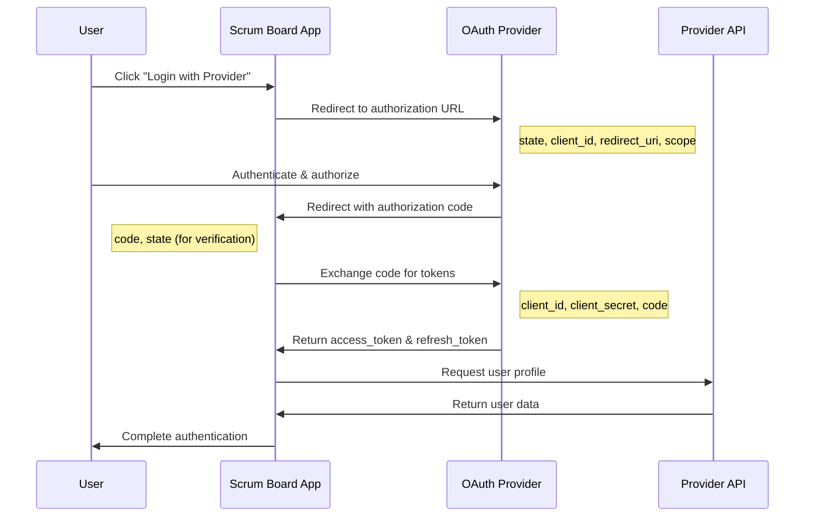

# OAuth 2.0 and Social Login Integration Guide

## Overview

This guide provides comprehensive documentation for implementing OAuth 2.0 and social login integration in the Scrum board application. OAuth 2.0 enables secure, delegated access to user resources without exposing credentials.

## Table of Contents

1. [OAuth 2.0 Fundamentals](#oauth-20-fundamentals)
2. [Implementation Architecture](#implementation-architecture)
3. [Provider Setup Overview](#provider-setup-overview)
4. [Integration Workflow](#integration-workflow)
5. [Code Implementation](#code-implementation)
6. [Testing and Debugging](#testing-and-debugging)
7. [Deployment Considerations](#deployment-considerations)

## OAuth 2.0 Fundamentals

### Authorization Code Flow

The authorization code flow is the most secure OAuth 2.0 flow for web applications:



### Key Components

#### 1. Authorization Request
```typescript
const authUrl = new URL('https://provider.com/oauth/authorize');
authUrl.searchParams.set('client_id', process.env.OAUTH_CLIENT_ID);
authUrl.searchParams.set('redirect_uri', 'https://app.com/auth/callback');
authUrl.searchParams.set('response_type', 'code');
authUrl.searchParams.set('scope', 'read:user user:email');
authUrl.searchParams.set('state', cryptoRandomString(32)); // CSRF protection
```

#### 2. Token Exchange
```typescript
const tokenResponse = await fetch('https://provider.com/oauth/token', {
  method: 'POST',
  headers: { 'Content-Type': 'application/x-www-form-urlencoded' },
  body: new URLSearchParams({
    client_id: process.env.OAUTH_CLIENT_ID,
    client_secret: process.env.OAUTH_CLIENT_SECRET,
    code: authorizationCode,
    redirect_uri: 'https://app.com/auth/callback',
    grant_type: 'authorization_code'
  })
});
```

## Implementation Architecture

### System Components

```
┌─────────────────┐    ┌──────────────────┐    ┌─────────────────┐
│   Frontend      │    │   Backend API    │    │ OAuth Provider  │
│   (Next.js)     │    │   (Next.js API)  │    │ (Google/GitHub) │
└─────────────────┘    └──────────────────┘    └─────────────────┘
         │                       │                       │
         │ 1. Initiate OAuth     │                       │
         ├──────────────────────▶│                       │
         │                       │ 2. Redirect to OAuth │
         │                       ├──────────────────────▶│
         │ 3. User authorizes    │                       │
         │◀──────────────────────┼───────────────────────┤
         │                       │ 4. Authorization code│
         │                       │◀──────────────────────┤
         │                       │ 5. Exchange for token│
         │                       ├──────────────────────▶│
         │                       │ 6. Access token      │
         │                       │◀──────────────────────┤
         │ 7. Set session cookie │                       │
         │◀──────────────────────┤                       │
```

### Next.js API Routes Structure

```
pages/api/auth/
├── [...nextauth].ts          # NextAuth.js configuration
├── providers/
│   ├── google.ts            # Google OAuth handler
│   ├── github.ts            # GitHub OAuth handler
│   ├── microsoft.ts         # Microsoft OAuth handler
│   └── slack.ts             # Slack OAuth handler
└── callback/
    ├── google.ts            # Google callback handler
    ├── github.ts            # GitHub callback handler
    ├── microsoft.ts         # Microsoft callback handler
    └── slack.ts             # Slack callback handler
```

## Provider Setup Overview

### Supported Providers

| Provider | OAuth Version | PKCE Support | Enterprise SSO |
|----------|---------------|--------------|----------------|
| Google | OAuth 2.0 | Yes | Yes (Google Workspace) |
| GitHub | OAuth 2.0 | Yes | Yes (GitHub Enterprise) |
| Microsoft | OAuth 2.0 | Yes | Yes (Azure AD) |
| Slack | OAuth 2.0 | Yes | Yes (Enterprise Grid) |
| SAML 2.0 | N/A | N/A | Yes |

### Required Environment Variables

```bash
# Google OAuth
GOOGLE_CLIENT_ID=your_google_client_id
GOOGLE_CLIENT_SECRET=your_google_client_secret

# GitHub OAuth
GITHUB_CLIENT_ID=your_github_client_id
GITHUB_CLIENT_SECRET=your_github_client_secret

# Microsoft OAuth
MICROSOFT_CLIENT_ID=your_microsoft_client_id
MICROSOFT_CLIENT_SECRET=your_microsoft_client_secret

# Slack OAuth
SLACK_CLIENT_ID=your_slack_client_id
SLACK_CLIENT_SECRET=your_slack_client_secret

# SAML Configuration
SAML_ISSUER=your_saml_issuer
SAML_CERT=your_saml_certificate
SAML_SSO_URL=your_saml_sso_url

# Application Settings
NEXTAUTH_URL=https://your-app-domain.com
NEXTAUTH_SECRET=your_nextauth_secret_key
```

## Integration Workflow

### 1. Provider Registration

Each OAuth provider requires application registration:

1. **Create Application**: Register your app with the provider
2. **Configure Redirect URIs**: Set callback URLs
3. **Set Permissions**: Define required scopes
4. **Obtain Credentials**: Get client ID and secret
5. **Test Configuration**: Verify setup in development

### 2. NextAuth.js Configuration

```typescript
// pages/api/auth/[...nextauth].ts
import NextAuth from 'next-auth';
import GoogleProvider from 'next-auth/providers/google';
import GitHubProvider from 'next-auth/providers/github';
import AzureADProvider from 'next-auth/providers/azure-ad';

export default NextAuth({
  providers: [
    GoogleProvider({
      clientId: process.env.GOOGLE_CLIENT_ID!,
      clientSecret: process.env.GOOGLE_CLIENT_SECRET!,
      authorization: {
        params: {
          scope: 'openid email profile',
          prompt: 'consent',
        }
      }
    }),
    GitHubProvider({
      clientId: process.env.GITHUB_CLIENT_ID!,
      clientSecret: process.env.GITHUB_CLIENT_SECRET!,
      authorization: {
        params: {
          scope: 'read:user user:email',
        }
      }
    }),
    AzureADProvider({
      clientId: process.env.MICROSOFT_CLIENT_ID!,
      clientSecret: process.env.MICROSOFT_CLIENT_SECRET!,
      tenantId: process.env.MICROSOFT_TENANT_ID,
    })
  ],
  callbacks: {
    async signIn({ user, account, profile }) {
      // Custom sign-in logic
      return true;
    },
    async session({ session, token }) {
      // Customize session object
      session.accessToken = token.accessToken;
      return session;
    },
    async jwt({ token, account, profile }) {
      // Persist OAuth access token
      if (account) {
        token.accessToken = account.access_token;
        token.provider = account.provider;
      }
      return token;
    }
  },
  pages: {
    signIn: '/auth/signin',
    error: '/auth/error',
  }
});
```

### 3. Frontend Integration

```typescript
// components/auth/SocialLoginButton.tsx
import { signIn } from 'next-auth/react';

interface SocialLoginButtonProps {
  provider: 'google' | 'github' | 'microsoft' | 'slack';
  children: React.ReactNode;
}

export function SocialLoginButton({ provider, children }: SocialLoginButtonProps) {
  const handleLogin = () => {
    signIn(provider, {
      callbackUrl: '/dashboard',
      redirect: true
    });
  };

  return (
    <button
      onClick={handleLogin}
      className="w-full flex items-center justify-center px-4 py-2 border border-gray-300 rounded-md shadow-sm bg-white text-sm font-medium text-gray-500 hover:bg-gray-50"
    >
      {children}
    </button>
  );
}
```

## Code Implementation

### OAuth Service Layer

```typescript
// lib/auth/oauth-service.ts
export class OAuthService {
  private providers = new Map();

  constructor() {
    this.registerProviders();
  }

  private registerProviders() {
    this.providers.set('google', new GoogleOAuthProvider());
    this.providers.set('github', new GitHubOAuthProvider());
    this.providers.set('microsoft', new MicrosoftOAuthProvider());
    this.providers.set('slack', new SlackOAuthProvider());
  }

  async initiateLogin(provider: string, redirectUri: string) {
    const oauthProvider = this.providers.get(provider);
    if (!oauthProvider) {
      throw new Error(`Unsupported provider: ${provider}`);
    }

    return oauthProvider.getAuthorizationUrl(redirectUri);
  }

  async handleCallback(provider: string, code: string, state: string) {
    const oauthProvider = this.providers.get(provider);
    if (!oauthProvider) {
      throw new Error(`Unsupported provider: ${provider}`);
    }

    // Verify state parameter for CSRF protection
    if (!this.verifyState(state)) {
      throw new Error('Invalid state parameter');
    }

    const tokens = await oauthProvider.exchangeCodeForTokens(code);
    const userProfile = await oauthProvider.getUserProfile(tokens.access_token);

    return {
      tokens,
      userProfile,
      provider
    };
  }

  private verifyState(state: string): boolean {
    // Implement state verification logic
    return true; // Simplified for example
  }
}
```

### User Profile Mapping

```typescript
// lib/auth/profile-mapper.ts
export interface StandardUserProfile {
  id: string;
  email: string;
  name: string;
  avatar?: string;
  provider: string;
  providerAccountId: string;
}

export class ProfileMapper {
  static mapGoogleProfile(profile: any): StandardUserProfile {
    return {
      id: profile.sub,
      email: profile.email,
      name: profile.name,
      avatar: profile.picture,
      provider: 'google',
      providerAccountId: profile.sub
    };
  }

  static mapGitHubProfile(profile: any): StandardUserProfile {
    return {
      id: profile.id.toString(),
      email: profile.email,
      name: profile.name || profile.login,
      avatar: profile.avatar_url,
      provider: 'github',
      providerAccountId: profile.id.toString()
    };
  }

  static mapMicrosoftProfile(profile: any): StandardUserProfile {
    return {
      id: profile.oid,
      email: profile.email || profile.preferred_username,
      name: profile.name,
      avatar: null, // Microsoft Graph API call needed
      provider: 'microsoft',
      providerAccountId: profile.oid
    };
  }
}
```

### Account Linking

```typescript
// lib/auth/account-linking.ts
export class AccountLinkingService {
  async linkAccount(userId: string, oauthAccount: OAuthAccount) {
    // Check if account is already linked
    const existingLink = await this.findExistingLink(
      oauthAccount.provider,
      oauthAccount.providerAccountId
    );

    if (existingLink && existingLink.userId !== userId) {
      throw new Error('Account already linked to different user');
    }

    // Create account link
    return await this.createAccountLink({
      userId,
      provider: oauthAccount.provider,
      providerAccountId: oauthAccount.providerAccountId,
      accessToken: oauthAccount.access_token,
      refreshToken: oauthAccount.refresh_token,
      expiresAt: oauthAccount.expires_at
    });
  }

  async unlinkAccount(userId: string, provider: string) {
    // Ensure user has other authentication methods
    const userAccounts = await this.getUserAccounts(userId);

    if (userAccounts.length <= 1) {
      throw new Error('Cannot unlink last authentication method');
    }

    return await this.removeAccountLink(userId, provider);
  }
}
```

## Testing and Debugging

### Testing OAuth Flow

```typescript
// __tests__/auth/oauth.test.ts
describe('OAuth Integration', () => {
  test('should generate valid authorization URL', () => {
    const oauthService = new OAuthService();
    const authUrl = oauthService.getAuthorizationUrl('google', 'http://localhost:3000/callback');

    expect(authUrl).toContain('https://accounts.google.com/oauth/authorize');
    expect(authUrl).toContain('client_id=');
    expect(authUrl).toContain('state=');
  });

  test('should handle callback successfully', async () => {
    const mockCode = 'test_authorization_code';
    const mockState = 'test_state';

    const result = await oauthService.handleCallback('google', mockCode, mockState);

    expect(result).toHaveProperty('tokens');
    expect(result).toHaveProperty('userProfile');
    expect(result.provider).toBe('google');
  });
});
```

### Debug Configuration

```typescript
// lib/auth/debug.ts
export const authDebug = {
  logAuthRequest: (provider: string, redirectUri: string) => {
    if (process.env.NODE_ENV === 'development') {
      console.log(`[OAuth] Initiating ${provider} auth with redirect: ${redirectUri}`);
    }
  },

  logTokenExchange: (provider: string, success: boolean) => {
    if (process.env.NODE_ENV === 'development') {
      console.log(`[OAuth] Token exchange for ${provider}: ${success ? 'SUCCESS' : 'FAILED'}`);
    }
  },

  logUserProfile: (profile: any) => {
    if (process.env.NODE_ENV === 'development') {
      console.log('[OAuth] User profile received:', {
        id: profile.id,
        email: profile.email,
        provider: profile.provider
      });
    }
  }
};
```

## Deployment Considerations

### Environment Configuration

```bash
# Production environment variables
NEXTAUTH_URL=https://scrumboard.yourdomain.com
NEXTAUTH_SECRET=your-production-secret-key

# OAuth Provider URLs (production)
GOOGLE_CLIENT_ID=prod_google_client_id
GITHUB_CLIENT_ID=prod_github_client_id
MICROSOFT_CLIENT_ID=prod_microsoft_client_id
```

### Security Headers

```typescript
// next.config.js
module.exports = {
  async headers() {
    return [
      {
        source: '/api/auth/:path*',
        headers: [
          {
            key: 'X-Frame-Options',
            value: 'DENY'
          },
          {
            key: 'X-Content-Type-Options',
            value: 'nosniff'
          },
          {
            key: 'Referrer-Policy',
            value: 'strict-origin-when-cross-origin'
          }
        ]
      }
    ];
  }
};
```

### Rate Limiting

```typescript
// lib/auth/rate-limiter.ts
import { Ratelimit } from '@upstash/ratelimit';

const ratelimit = new Ratelimit({
  redis: Redis.fromEnv(),
  limiter: Ratelimit.slidingWindow(5, '1 m'), // 5 requests per minute
});

export async function rateLimitOAuth(request: Request) {
  const ip = request.headers.get('x-forwarded-for') ?? 'anonymous';
  const { success } = await ratelimit.limit(ip);

  if (!success) {
    throw new Error('Rate limit exceeded');
  }
}
```

## Related Documentation

- [Google OAuth Setup Guide](./oauth-providers/google.md)
- [GitHub OAuth Setup Guide](./oauth-providers/github.md)
- [Microsoft OAuth Setup Guide](./oauth-providers/microsoft.md)
- [Slack OAuth Setup Guide](./oauth-providers/slack.md)
- [SAML 2.0 Setup Guide](./oauth-providers/saml.md)
- [OAuth Security Best Practices](./oauth-security.md)

## Troubleshooting

### Common Issues

1. **Invalid Redirect URI**: Ensure redirect URIs match exactly in provider configuration
2. **CORS Errors**: Configure proper CORS headers for cross-origin requests
3. **State Mismatch**: Verify state parameter handling for CSRF protection
4. **Token Expiration**: Implement proper token refresh logic
5. **Scope Permissions**: Request minimum required scopes for functionality

### Support Resources

- NextAuth.js Documentation: https://next-auth.js.org/
- OAuth 2.0 Specification: https://tools.ietf.org/html/rfc6749
- OpenID Connect Specification: https://openid.net/connect/